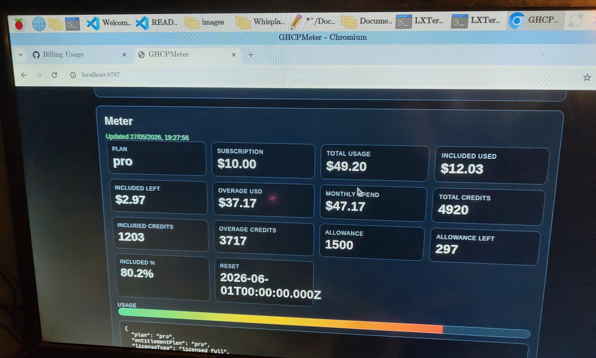
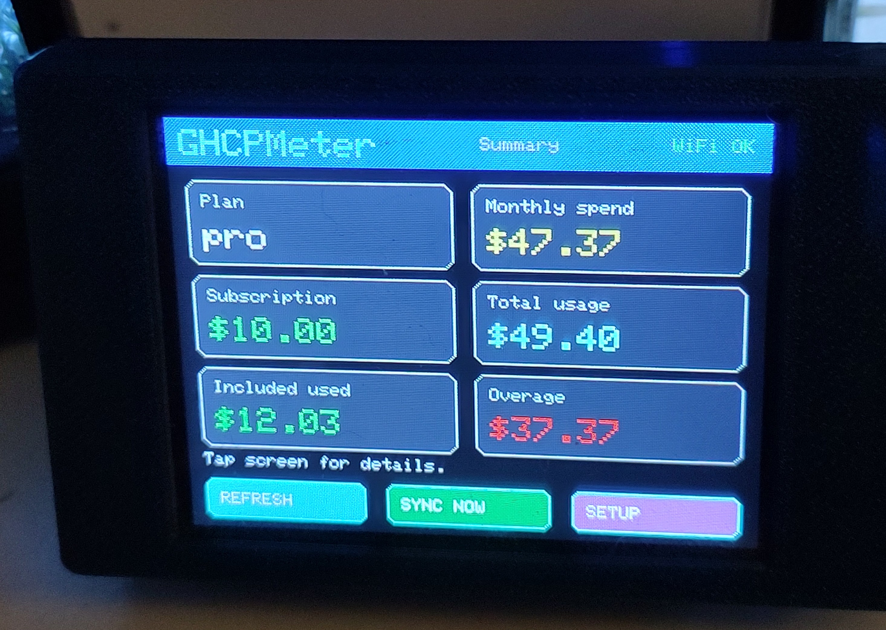
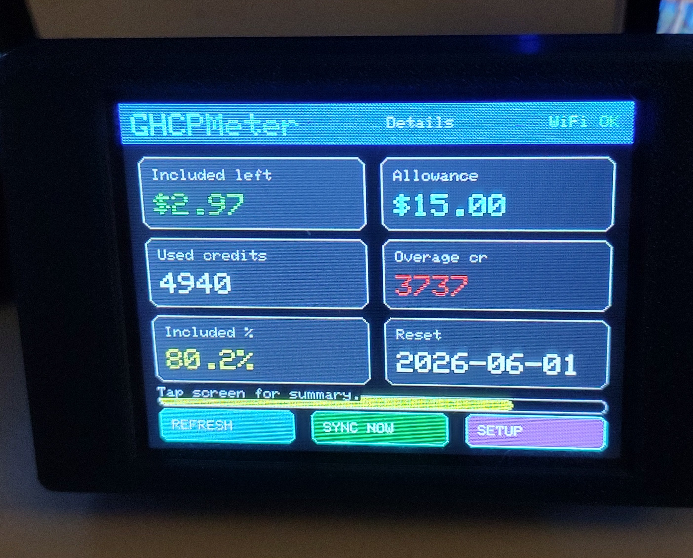

# GHCPMeter

GHCPMeter is a small local dashboard for **GitHub Copilot personal metered usage**.

It runs as a lightweight Node helper on a Pi or desktop, reads the same GitHub billing data your browser sees, and exposes that data in two ways:

1. a **browser dashboard** on the host machine
2. a **local JSON API** for small LAN display clients like ESP32/CYD devices

## What it shows

GHCPMeter focuses on the billing numbers that are actually useful day to day:

- current plan
- subscription cost
- total metered usage
- included usage consumed
- included usage remaining
- billed overage
- total monthly spend
- credit equivalents
- reset date

## Project layout

```text
GHCPMeter/
├── README.md
├── package.json
├── src/
│   └── server.js
├── data/
│   └── settings.json          # local-only, gitignored
├── images/
│   └── ...project photos...
└── InvertedCYD/
    ├── platformio.ini
    ├── include/
    ├── src/
    └── README.md
```

## Screenshots / photos

### Browser helper



### Inverted CYD client





## How it works

GitHub already exposes personal Copilot billing data to the billing page in your browser. GHCPMeter does **not** log into GitHub directly with OAuth or a token. Instead, it uses your existing browser session data locally on your own machine.

The helper polls:

- `https://github.com/settings/billing/usage_chart?group=0&period=3&product=&query=`
- `https://github.com/github-copilot/chat/entitlement`

It then combines those responses into a single meter payload and serves:

- `GET /` for the browser dashboard
- `GET /api/state`
- `GET /api/usage`
- `POST /api/settings`
- `POST /api/refresh`

## Requirements

### For the Node helper

- Node.js **20+**
- a GitHub browser session that can open the Copilot billing page
- network access to `github.com`

### For the optional CYD client

- an ESP32 CYD using the inverted-display wiring this project was built against
- PlatformIO
- Wi-Fi access to the same LAN as the helper

## Install and run the Node helper

Open the project directory:

```bash
cd /home/coreymillia/Documents/GHCPMeter
```

This project currently uses only built-in Node APIs, so there are no npm dependencies to install first.

Start the helper:

```bash
npm start
```

The helper will listen on:

```text
http://localhost:8787
```

From another device on your network, open:

```text
http://<helper-ip>:8787
```

Example:

```text
http://10.160.0.136:8787
```

## First-time setup

Open the dashboard in a browser and fill in the local settings form.

### Required

- **GitHub session cookie**

### Optional

- extra headers
- plan override (`auto`, `pro`, `pro+`, `max`)
- poll interval
- custom endpoint URLs

Settings are stored locally in:

```text
data/settings.json
```

That file is gitignored and should stay local.

## Getting the GitHub session cookie

The easiest safe workflow is:

1. log into GitHub in your browser
2. open the Copilot billing / usage page
3. open DevTools
4. find one of the GitHub billing requests
5. copy the **Cookie** header value
6. paste it into the GHCPMeter dashboard settings form

The helper normalizes common pasted formats, including values copied with a leading `cookie:` label.

## Security notes

- **Do not commit** live GitHub session cookies
- **Do not paste** live cookies into source files
- if you accidentally expose a live cookie publicly, log out and back into GitHub to invalidate that session
- treat `data/settings.json` as sensitive local config

## Browser dashboard

The browser dashboard is the main standalone UI.

It shows:

- plan
- subscription
- total usage
- included usage used
- included usage left
- billed overage
- monthly spend
- credit values
- reset date

It also lets you:

- save local config
- manually refresh usage
- inspect the raw meter JSON

## API

### `GET /api/state`

Returns the public helper settings plus the current usage state.

### `GET /api/usage`

Returns the current meter payload directly.

Example shape:

```json
{
  "ok": true,
  "lastUpdated": 1779930000000,
  "lastError": "",
  "meter": {
    "plan": "pro",
    "subscriptionUsd": 10,
    "totalUsageUsd": 49.82,
    "currentMeteredUsageUsd": 49.82,
    "includedAllowanceUsd": 15,
    "includedUsageConsumedUsd": 12.02,
    "remainingIncludedUsd": 2.98,
    "overageUsd": 37.08,
    "billedOverageUsd": 37.08,
    "totalMonthlySpendUsd": 47.08,
    "usedCredits": 4982,
    "includedCredits": 1500,
    "includedUsageConsumedCredits": 1202,
    "overageCredits": 3708,
    "remainingIncludedCredits": 298,
    "includedUsagePercent": 80.1,
    "resetDateUtc": "2026-06-01T00:00:00.000Z",
    "overagesEnabled": true
  }
}
```

### `POST /api/settings`

Saves local helper settings.

Example:

```json
{
  "githubCookie": "user_session=...",
  "planOverride": "auto",
  "pollIntervalSec": 60
}
```

### `POST /api/refresh`

Immediately refreshes the GitHub data and returns the latest state.

## Optional ESP32 client: InvertedCYD

An optional CYD client lives here:

```text
/home/coreymillia/Documents/GHCPMeter/InvertedCYD
```

It is based on the inverted-display CompanionCYD hardware pattern from the larger Whisplay project, but trimmed down to just the meter use case.

### Features

- captive setup portal
- stores Wi-Fi + helper host settings in Preferences
- polls `GET /api/usage`
- can trigger `POST /api/refresh`
- summary screen + details screen
- touch toggle between pages

### Build

```bash
pio run -d /home/coreymillia/Documents/GHCPMeter/InvertedCYD
```

### Flash

If your board is connected on the default serial port:

```bash
pio run -d /home/coreymillia/Documents/GHCPMeter/InvertedCYD -t upload
```

If you need to specify a port:

```bash
pio run -d /home/coreymillia/Documents/GHCPMeter/InvertedCYD -t upload --upload-port /dev/ttyACM0
```

### CYD setup

1. flash the firmware
2. hold **BOOT** while powering on to enter setup
3. connect to Wi-Fi network `GHCPMeterCYD-Setup`
4. open `http://192.168.4.1`
5. save:
   - your Wi-Fi SSID/password
   - the helper host or IP
   - helper port (`8787` by default)
   - poll interval

### Important CYD note

For the CYD, **helper host / IP** means the LAN address of the machine running:

```bash
npm start
```

Do **not** use `localhost` on the ESP32. The CYD must use the helper machine's real network IP.

### Touch controls

- **REFRESH**: fetch the current `/api/usage`
- **SYNC NOW**: tell the helper to refresh GitHub first, then reload usage
- **SETUP**: reopen the local setup portal
- **tap anywhere above the bottom buttons**: switch between summary and details

## Scripts

From the project root:

```bash
npm start
npm run check
```

## Troubleshooting

### The browser dashboard says auth is missing

Your GitHub session cookie is not saved yet, expired, or malformed. Paste a fresh cookie from your logged-in browser session.

### The helper works on the Pi but the CYD cannot connect

Make sure the CYD is using the helper machine's LAN IP, not `localhost`, and that both devices are on the same network.

### The CYD opens setup every boot

That usually means settings were never saved or BOOT is being held during power-on.

### The meter looks stale

Use **SYNC NOW** on the CYD or `POST /api/refresh` on the helper.

### GitHub changed their billing payload

This project depends on GitHub's current browser-facing billing endpoints. If GitHub changes those response shapes, the helper may need to be updated.

## Current status

Working now:

- local Node helper
- local browser dashboard
- local config storage
- billing aggregation and meter payload
- optional InvertedCYD ESP32 client

Planned / likely future improvements:

- more polished browser UI
- more device client layouts
- cleaner onboarding for session cookie setup
- optional packaging as a standalone repository release
